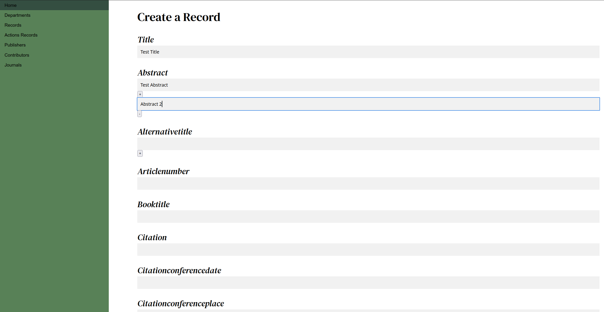
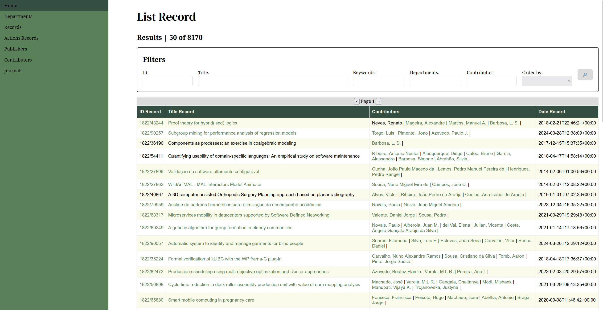
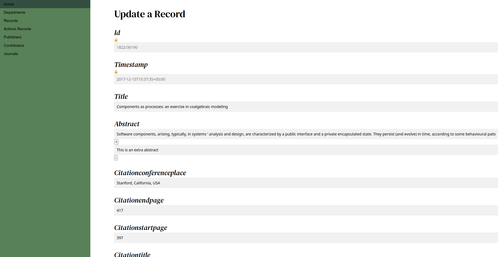
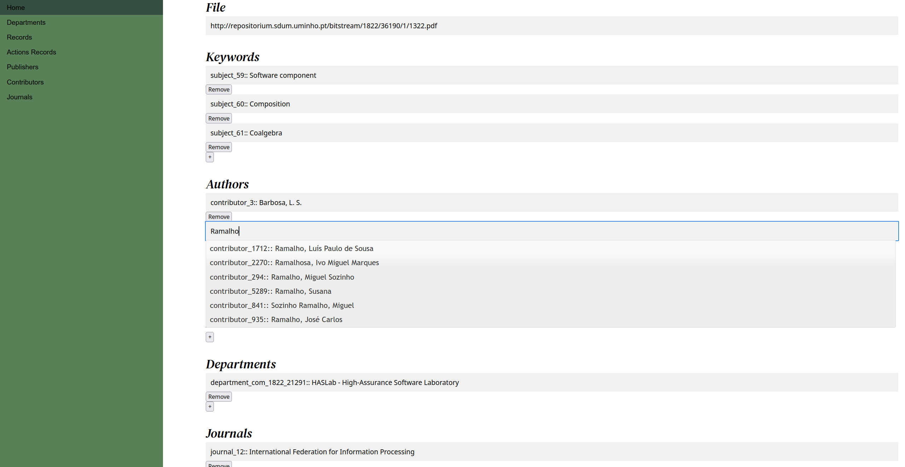
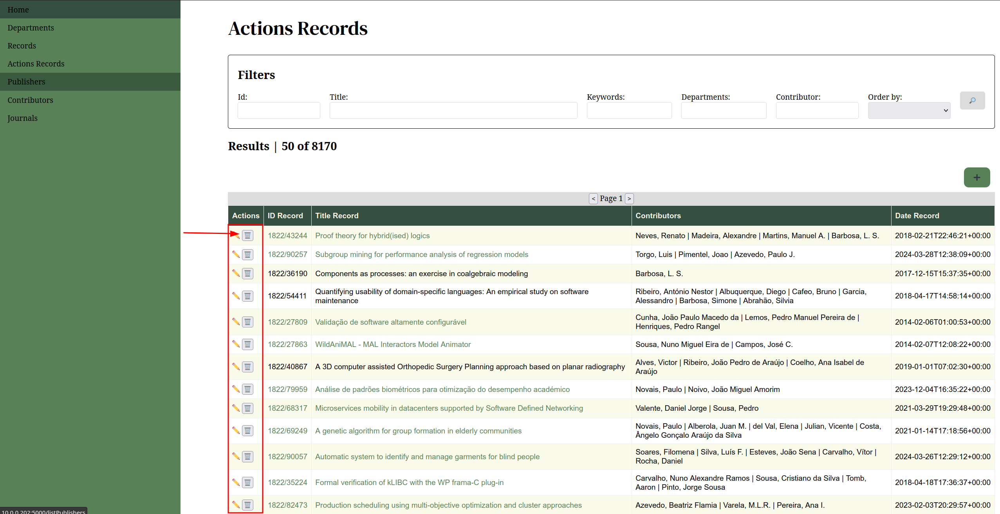

# Repositorium v2
```
O **repositorium v2** é uma aplicação web que funciona sobre uma ontologia ttl que disponibiliza ao utilizador a capacidade de consultar, criar, apagar e editar registos. Estes registos correspondem à produção intelectual da Universidade do Minho em formato digital.
```
## Introdução
O presente relatório incide sobre o projeto desenvolvido para a UC RPCW pelos estudantes Diogo Barbosa (pg50326) e Alice Teixeira (pg52670), sendo que o objetivo foi desenvolver uma aplicação para gestão de uma base de dados em grafos, com base em dados obtidos do Repositorium desenvolvido pela UMinho.

## Ontologia
A nível de classes, foram criadas as classes Contributor (subclasses Author, Editor, Advisor, Other), Department, FundingEntity, Journal, PublisherEntity, Subject, e, finalmente, Record.

Para cada uma destas entidades criaram-se duas relações com a classe Record, de forma a ter bilateralidade na relação. A título de exemplo, para a classe Department, foi criada a relação in_dep de domain Record e range Department e a relação dep_has_rec de domain Deparment e range Record.

A nível de data properties, foi usada uma nomenclatura 'classe_nameDataProperty', sendo que se encontram abaixo uma lista para exposição das data properties criadas, organizadas por classe.

- Classe Contributor
    - contributor_authority
    - contributor_confidence
    - contributor_id
    - contributor_name
- Classe Department
    - department_id
    - department_name
- Classe FundingEntity
    - funding_name
    - funding_uri
- Classe Journal
    - journal_authority
    - journal_confidence
    - journal_name
- Classe Publisher
    - publisher_name
    - publisher_uri
- Classe Record
    - record_abstract
    - record_alternativeTitle
    - record_articlenumber
    - record_bookTitle
    - record_citation
    - record_citationConferenceDate
    - record_citationConferencePlace
    - record_citationEdition
    - record_citationEndPage
    - record_citationIssue
    - record_citationStartPage
    - record_citationTitle
    - record_citationVolume
    - record_comments
    - record_conferencePublication
    - record_dateEmbargo
    - record_dateIssued
    - record_degre_grade
    - record_degree_grantor
    - record_description
    - record_doi
    - record_eisbn
    - record_eissn
    - record_embargoFct
    - record_eventLocation
    - record_eventTitle
    - record_eventType
    - record_export
    - record_exportIdentifier
    - record_fundingAward
    - record_fundingStream
    - record_hasVersion
    - record_id
    - record_isBasedOn
    - record_isPartOfSeries
    - record_isbn
    - record_issn
    - record_journal
    - record_language
    - record_number
    - record_ogUri
    - record_other
    - record_pagination
    - record_peerReviewed
    - record_pmc
    - record_pmid
    - record_publicationStatus
    - record_publicationversion
    - record_publisherVersion
    - record_relation
    - record_relationUri
    - record_rights
    - record_rightsUri
    - record_sponsorship
    - record_tid
    - record_timestamp
    - record_title
    - record_type
    - record_uoei
    - record_version
    - record_volume
- Classe Subject
    - subject_
    - subject_acm
    - subject_arxiv
    - subject_fos
    - subject_jel
    - subject_ods
    - subject_udc
    - subject_wos

Note-se que todos os campos têm uma correlação com o atributos dos XML retirados da API do Repositorium.

## Recolha de informação

A recolha da informação utilizada neste projeto foi feita através do endpoint [https://repositorium.sdum.uminho.pt/oai/oai](https://repositorium.sdum.uminho.pt/oai/oai). Para esse efeito a API fornecia vários *metadata formats*, no entanto, os mesmos não continham todos a mesma informação, as informações principais eram comuns em todos os formatos, mas alguns campos só se encontravam em certos formatos. Por isso foi necessário escolher que os formatos de modo a obter uma extrato representativo do universo de informação do repositorium. No final escolhemos os formatos **dim**, que continha grande parte da informação importante de forma clara, e **oai_openaire**, que disponha das fontes de financiamento e link de download de cada Record.

Toda a informação é recolhida inicialmente através de um script getAllXml.py, que recolhe e guarda localmente a informação em ficheiros xml. Este script recolhe a informação pertinente dos formatos mencionados (**dim** e **oai_openaire**) e dos departamentos listados no ficheiro sets.json.

De seguida, a ontologia base é povoada com o script populate.py, que lê os ficheiros recolhidos um a um e tem como output o ficheiro repositorium.ttl. Este é usado diretamente no **repositorium v2**.


## CRUD
Foi criada uma aplicação web para gestão da base de dados criada e populada. Esta aplicação assegurou as funções CRUD para a classe Record em específico, sendo para as restantes classes a sua visualização de instâncias é possível, e na classe Subject a sua criação é também assegurada. 

Deste modo, iremos descrever em pormenor o processo de cada função CRUD para instâncias da classe Record.

Primeiramente, devemos notar que a manipulação (métodos de Create, Update e Delete) das instâncias Record é somente efetuada na página corresponde à route 'actionsRecords', sendo um display de várias instâncias efetuado nesta página, mas também na página da route 'listRecords', esta última limitada na sua manipulação da base de dados.

Da página visualizada na route 'actionsRecords', vizualiza-se uma tabela com uma coluna 'Actions', em que cada row da tabela contém dois botões, correspondentes à edição e eliminação desse mesmo record.

### Create

Relativamente à criação de um record, esta ação é efetuada a partir de um botão '+', localizado acima da tabela.

A partir do clique nesse botão, o utilizador é reencaminhado para uma route 'createRecord', que corresponde a uma nova página, com um formulário para introdução dos campos (data properties) associadas a um record, mas também introdução de dados sobre instâncias de outras classes associadas a esse mesmo record (por exemplo, autores e departamentos associados a estes).

Note-se que para a introdução de dados de classes associadas ao record, beneficia-se de um autocomplete, que propõe nomes e ids de instâncias dessa mesma classe conforme o utilizador vai introduzindo dados. Qualquer valor que divirja do formato proposto (exceto para subjects/keywords) pelo autocomplete este é ignorado. Caso seja uma keyword que não siga o formato, esta é criada à base de dados.

Além disso, a criação de records permite também a introdução de valores múltiplos para campos específicos, por meio de clique de um botão '+' perto do campo a ser introduzido. A introdução de múltiplos valores pode ser também ela retirada, por meio de clique do botão '-', associado a cada valor múltiplo de um campo.

É importante mencionar que para cada Record criado através do **repositorium v2** é gerado um novo id do tipo 0000/x, de forma a nunca coincidir com os ids já existentes, permitindo no futuro atualizações vindas do repositorium oficial sem causar nenhum tipo de inconsistencias na base de dados.




### Read

As páginas das rotas 'actionsRecords' e 'listRecords' ambas mostram uma vista reduzida das instâncias de records, sendo que uma vista em pormenor é produzida ao clicar sobre o nome ou id numa row das tabelas disponíveis nestas páginas.

Adicionalmente, ambas estas páginas dispõe de filtros, ou seja um formulário para introdução de valores correspondentes a um id exato, um titulo parcial, uma keyword, o nome parcial de um departamento, o nome parcial de um contribuidor e uma ordenação de dados, para melhor pesquisar os dados.



### Update

O update, tal como mencionado anteriormente, é acessível pela página 'actionsRecords', por clique num botão com o símbolo de um lápis na coluna 'Actions' num record específico. A partir desse botão, o utilizador é reencaminhado para uma página de route 'updateRecord/<id>', sendo que esta página apresenta-se semelhante à página de criação de records.

A estratégia concebida para realizar o update por parte da base de dados foi a seguinte: fazer um delete dos dados relativos ao Record e introduzir novos valores atualizados (isto inclui atributos e relações da classe Record), mantendo as restantes entidades intactas. Para garantir a coerência dos dados apenas 2 atributos do Record  são geridos pela aplicação e não pelo utilizador: o **id** e o **timestamp**. Quando um update é feito o id é mantido e um novo **timestamp** é gerado imediatamente antes da query de update para marcar a hora do update, substituindo a antiga data de criação.

Relativamente à página no frontend da aplicação, pode-se alterar os valores outrora introduzidos do record, sendo que a multiplicidade de valores de um campo apresenta-se visível, cada valor de um campo num input próprio para tal, carregado no 'load' da página. Mais uma vez, a multiplicidade pode ser retirada pelo clique do botão '-' associado aos campos.

Deste modo, o autocomplete apresenta-se também visível para campos de introdução de valores correspondentes a outras classes que não a Record; sendo que no caso do campo 'Keywords', tal como surge na criação de um record, a introdução de um texto sem identificador pressupõe a criação de uma nova keyword.




### Delete

O delete acontece por meio de clique no botão à direita da coluna 'Actions' na página da route 'actionsRecords', e este botão apenas efetua um HTTP request para o back-end, que efetua uma query de delete para a base de dados. No final é efetuado o reload da página.



## Limitações e Trabalho Futuro

A extensão do CRUD para todas as classes apresenta-se como trabalho futuro, bem como um Refactoring do código correspondente às páginas das routes 'actionsRecords' e 'listRecords'. Adicionalmente, a filtragem encontra-se bastante rudimentar, sendo que apenas apresenta resultados corretos para uma única página, a primeira, sendo que se alia à paginação como pontos a serem desenvolvidos em trabalho futuro. 

A funcionalidade de pesquisa pode ser melhorada. À exceção do id, o processamento das queries de pesquisa é um simples teste de substring direto para um determinado campo. Esta funcionalidade podia ser muito mais avançada recorrendo à separação por palavras de modo a ser mais flexível.

Pequenos detalhes no styling também são propostos, nomeadamente para alinhar os botões para criação e remoção de valores múltiplos para um campo.

Como detalhe final, propõe-se também um login com credenciais, sendo que a página  correspondente à 'actionsRecords' deveria ficar bloqueada para utilizadores administradores do sistema.

