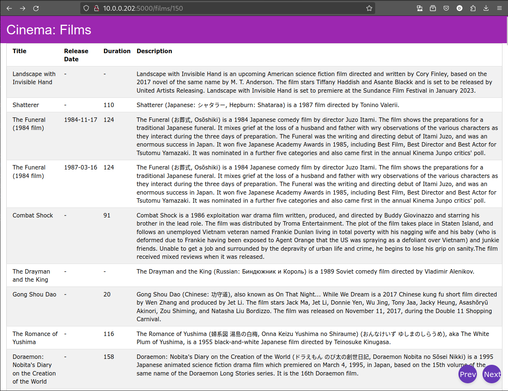
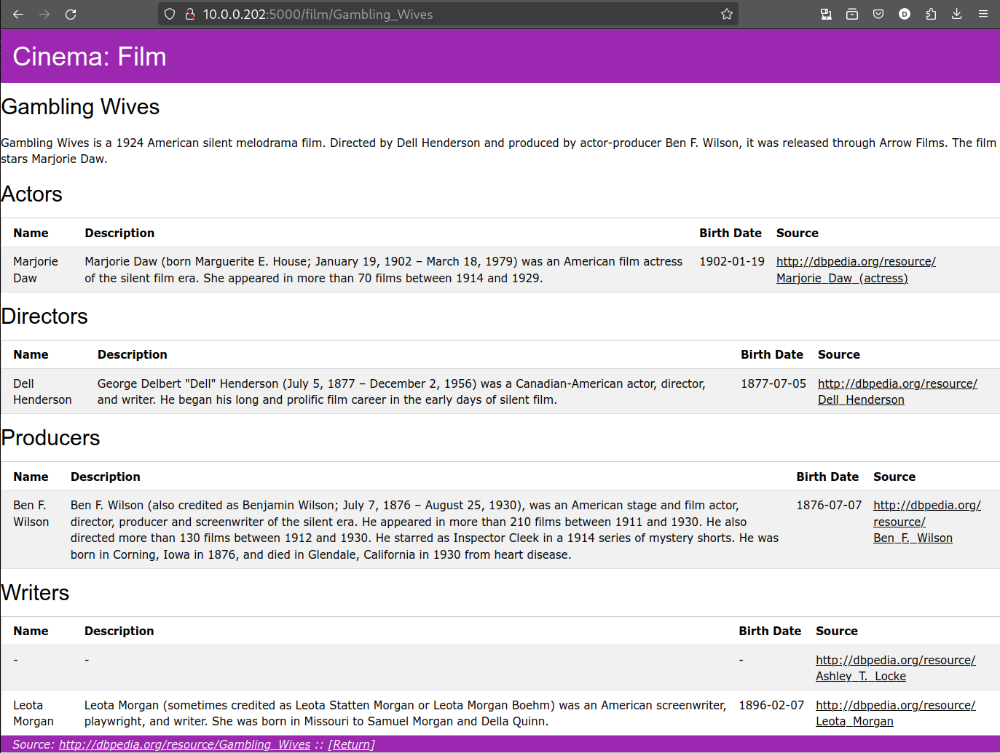
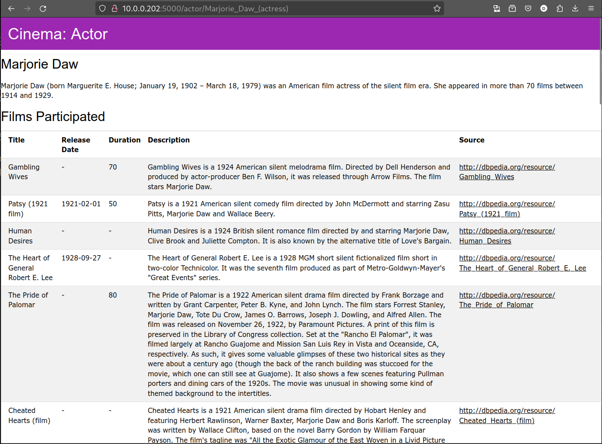

# App cinema

## Requisitos

* É necessária a biblioteca ```flask```

* Esta aplicação faz queries por default ao endpoint http://localhost:7200/repositories/TabPeriodica, por isso este repositório tem que existir para o website funcionar.


## Utilização

* A execução do programa é com o comando: ```python app.py``` que inicializa o website, acessível em http://localhost:5000.


## Recolha de informação

Toda a informação presente foi obtida a partir da API da [dbpedia.org](https://dbpedia.org) e encontra-se em forma de ontologia no ficheiro [cinemaOutput.ttl](ontology/cinemaOutput.ttl).

O script de povoamento [script.py](ontology/script.py) começa a partir de um ficheiro [cinema.ttl](ontology/cinema.ttl) que contém uma ontologia não povoada acerca do cinema. De seguida são usados of ficheiros [updatedFilms.json](../../TPC5/json/updatedFilms.json) e [people.json](./../TPC5/json/people.json) gerados no TPC5 para povoar esta ontologia, gerando como output o ficheiro [cinemaOutput.ttl](ontology/cinemaOutput.ttl).

## Descrição

Aplicação web que permite explorar a arte do cinema.

Esta aplicação contém uma página inicial e páginas que expõem a lista completa de filmes, atores, escritores, compositores, diretores e produtores. Estas páginas mencionadas estão paginadas, com cada página a expor no máximo 100 resultados.

Estas páginas coletivas são tabelas que contém o conteúdo principal sobre cada entrada e também servem como links que levam à página específica do conteúdo selecionado, permitindo a navegação entre as páginas de  filmes e dos participantes associados.

Exemplo de uma página coletiva **/films** na página 150:

\



Por exemplo, ao carregar num filme, a aplicação redireciona para uma página com os dados principais do filme, tal como o elenco, escritores, etc. Como por exemplo:

\


Todas estas informações estão em formato de tabela e cada linha é uma ligação para a página individual do respetivo conteúdo. Por exemplo ao clicar na atriz Marjorie Draw, somos levados para a sua página onde estão expostos os filmes que fez parte e assim sucessivamente.

\



